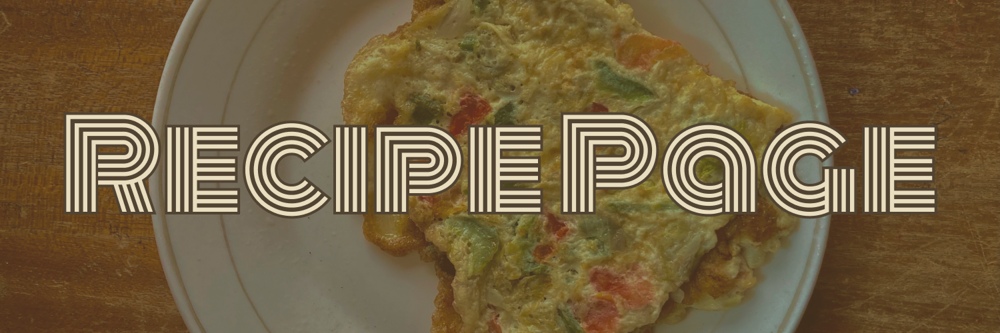

---

<h4 align="center">
  Building a responsive Egg Omelette recipe page using HTML and CSS
  and hosting it on GitHub Pages
</h4>

<p align="center">
  
  
  
</p>

<p align="center">
  <a href="#overview">Overview</a> -
  <a href="#structure">Structure</a> -
  <a href="#page-sections">Page Sections</a> -
  <a href="#hosting">Hosting</a>
</p>

---

## Overview

This project focuses on building a responsive recipe web page for a classic Egg Omelette as part of a
[Frontend Mentor challenge](https://www.frontendmentor.io/challenges/recipe-page-KiTsR8QQKm).
The page covers preparation time, ingredients, step-by-step instructions, and a nutritional table,
all styled with a clean typographic layout using Google Fonts (Young Serif + Outfit).
No JavaScript, no frameworks -- plain HTML and CSS only.

> This website is responsive and adapts to desktop, tablet, and mobile screen sizes.

---

## Structure

```
recipe_page/
|-- assets/
|   |-- favicon.png             <- browser tab icon
|   |-- image_omelette.jpeg     <- hero banner image
|   |-- project_cover_image.png <- README cover
|   |-- website_preview.jpg     <- site preview screenshot
|-- css/
|   |-- style.css               <- all page styles, layout, and responsive rules
|-- index.html                  <- single-page recipe website
|-- README.md
```

---

## Page Sections

| Section | Description |
|---------|-------------|
| Banner | Full-width omelette hero image at the top of the card |
| Intro | Recipe title and a short description of the dish |
| Preparation Time | Highlighted card showing total, prep, and cooking time |
| Ingredients | Bulleted list of required ingredients with optional filling note |
| Instructions | Numbered step-by-step cooking instructions |
| Nutrition | Grid table showing calories, carbs, protein, and fat per serving |
| Footer | Attribution line linking to Frontend Mentor and the developer |

---

## Hosting

This static website is hosted on GitHub Pages and can be viewed at:

**[Recipe Page](https://quantumudit.github.io/problem-solving/projects/frontendmentor/recipe_page/)**
