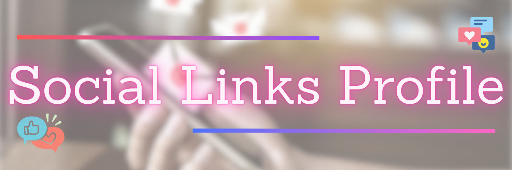

---

<h4 align="center">
  Building a responsive social links profile card using HTML and CSS
  and hosting it on GitHub Pages
</h4>

<p align="center">
  
  
  
</p>

<p align="center">
  <a href="#overview">Overview</a> -
  <a href="#structure">Structure</a> -
  <a href="#page-sections">Page Sections</a> -
  <a href="#hosting">Hosting</a>
</p>

---

## Overview

This project focuses on building a responsive social links profile card for a fictitious front-end
developer named **Jessica Randall** as part of a
[Frontend Mentor challenge](https://www.frontendmentor.io/challenges/social-links-profile-UG32l9m6dQ/).
The card displays a profile picture, name, location, a short bio, and five social media links
with a hover color-transition effect. Styled entirely with CSS Flexbox and custom properties.
No JavaScript, no frameworks.

> This website is responsive and adapts to desktop, tablet, and mobile screen sizes.

---

## Structure

```
social_links_profile/
|-- assets/
|   |-- avatar_jessica.jpeg     <- circular profile photo
|   |-- favicon.png             <- browser tab icon
|   |-- project_cover_image.png <- README cover
|   |-- website_preview.jpg     <- site preview screenshot
|-- css/
|   |-- style.css               <- all page styles, layout, and responsive rules
|-- index.html                  <- single-page profile card website
|-- README.md
```

---

## Page Sections

| Section | Description |
|---------|-------------|
| Profile | Circular avatar, name (Jessica Randall), location (London, UK), and a short bio quote |
| Links | Five styled buttons -- GitHub, Frontend Mentor, LinkedIn, Twitter, Instagram -- with hover effect |
| Footer | Attribution line linking to Frontend Mentor and the developer |

---

## Hosting

This static website is hosted on GitHub Pages and can be viewed at:

**[Social Links Profile](https://quantumudit.github.io/problem-solving/projects/frontendmentor/social_links_profile/)**
