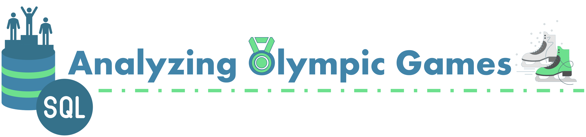

<h4 align="center">
  
</h4>

<p align="center">
  <a href="https://www.python.org/"></a>
  <a href="https://duckdb.org/"></a>
  
  <a href="https://www.kaggle.com/datasets/heesoo37/120-years-of-olympic-history-athletes-and-results"></a>
</p>

<p align="center">
  <a href="#overview">Overview</a> •
  <a href="#dataset">Dataset</a> •
  <a href="#libraries">Libraries</a> •
  <a href="#structure">Structure</a> •
  <a href="#questions">Questions</a> •
  <a href="#insights">Insights</a>
</p>

---

## Overview

A SQL-based analysis of 120 years of Olympic history spanning the Athens 1896 Games through
Rio 2016. Each row in the primary dataset represents one athlete competing in one event,
making it possible to slice by athlete, country, sport, event, year, and medal outcome.

The analysis uses plain SQL queries executed via DuckDB -- no ORM, no dataframe transforms.
Each question is a self-contained `.sql` file; a shared Python runner loads the CSV data as
views and runs each script, displaying results in a formatted terminal table.

---

## Dataset

Source: [Kaggle -- 120 Years of Olympic History](https://www.kaggle.com/datasets/heesoo37/120-years-of-olympic-history-athletes-and-results)

**athlete_events.csv** -- 271,116 rows x 15 columns

| Column | Type | Description |
|---|---|---|
| ID | Integer | Unique athlete identifier |
| Name | String | Athlete's full name |
| Sex | String | M or F |
| Age | Integer | Age at time of competition (nullable) |
| Height | Integer | Height in centimeters (nullable) |
| Weight | Float | Weight in kilograms (nullable) |
| Team | String | Team or country name |
| NOC | String | National Olympic Committee 3-letter code |
| Games | String | Year and season, e.g. "1992 Summer" |
| Year | Integer | Olympic year |
| Season | String | Summer or Winter |
| City | String | Host city |
| Sport | String | Sport category |
| Event | String | Specific event within the sport |
| Medal | String | Gold, Silver, Bronze, or NA |

**noc_regions.csv** -- 230 rows x 3 columns

| Column | Type | Description |
|---|---|---|
| NOC | String | 3-letter NOC code (join key to athlete_events) |
| region | String | Country or region name |
| notes | String | Supplementary notes (nullable) |

> See [data/README](data/README.md) for the full data dictionary, coverage stats, and ER diagram.

---

## Libraries

| Library | Purpose |
|---|---|
| [DuckDB](https://duckdb.org/) | In-process SQL engine -- reads CSVs as views and executes `.sql` files |
| [pandas](https://pandas.pydata.org/) | Receives DuckDB query results for display |
| [rich](https://rich.readthedocs.io/) | Terminal table formatting via shared `show()` utility |

> See [requirements.txt](requirements.txt) for pinned versions.

---

## Structure

```
olympic_history_analysis/
|-- assets/
|-- data/
|-- output/
|-- scripts/
|-- notes.md
|-- requirements.txt
|-- README.md
```

<details>
<summary><b>Folder & File Details</b></summary>

| Path | Description |
|---|---|
| [`data/`](data/README.md) | Raw CSV files from Kaggle (athlete_events.csv, noc_regions.csv) -- see README for data dictionary and ER diagram |
| `scripts/` | SQL solution files (qxx_solution.sql) and the shared DuckDB runner (runner.py) |
| `assets/` | Static images used in this README |
| `output/` | Generated chart outputs -- gitignored, tracked via .gitkeep |
| `notes.md` | Project-level learning notes and observations |
| `requirements.txt` | Python dependencies for this project |

</details>

---

## Questions

| # | Group | Question | Language | Script |
|---|---|---|---|---|
| q01 | Overview | How many Olympic Games have been held in total? | SQL | [q01_solution.sql](scripts/01_overview/q01_solution.sql) |
| q02 | Overview | List all Olympic Games held so far with their year, season, and host city | SQL | [q02_solution.sql](scripts/01_overview/q02_solution.sql) |
| q03 | Overview | How many nations participated in each Olympic Game? | SQL | [q03_solution.sql](scripts/01_overview/q03_solution.sql) |
| q04 | Overview | Which Olympic Game had the highest and lowest number of participating nations? | SQL | [q04_solution.sql](scripts/01_overview/q04_solution.sql) |
| q05 | Overview | Which nations have participated in every Olympic Game? | SQL | [q05_solution.sql](scripts/01_overview/q05_solution.sql) |
| q06 | Sports | Which sports have featured in every Summer Olympics? | SQL | [q06_solution.sql](scripts/02_sports/q06_solution.sql) |
| q07 | Sports | Which sports were played only once in Olympic history? | SQL | [q07_solution.sql](scripts/02_sports/q07_solution.sql) |
| q08 | Sports | How many sports were played in each Olympic Game? | SQL | [q08_solution.sql](scripts/02_sports/q08_solution.sql) |
| q09 | Athletes | What is the ratio of male to female athletes across all Olympics? | SQL | [q09_solution.sql](scripts/03_athletes/q09_solution.sql) |
| q10 | Athletes | Who are the top-3 oldest athletes to win a Gold medal? | SQL | [q10_solution.sql](scripts/03_athletes/q10_solution.sql) |
| q11 | Athletes | Who are the top 5 athletes with the most Gold medals? | SQL | [q11_solution.sql](scripts/03_athletes/q11_solution.sql) |
| q12 | Medals | Which are the top 5 countries by total medals won? | SQL | [q12_solution.sql](scripts/04_medals/q12_solution.sql) |
| q13 | Medals | What is the total Gold, Silver, and Bronze medal count for each country? | SQL | [q13_solution.sql](scripts/04_medals/q13_solution.sql) |
| q14 | Medals | Which countries have won Silver or Bronze medals but never won Gold? | SQL | [q14_solution.sql](scripts/04_medals/q14_solution.sql) |
| q15 | Medals | What are the Gold, Silver, and Bronze medal counts for each country per Olympic Game? | SQL | [q15_solution.sql](scripts/04_medals/q15_solution.sql) |
| q16 | Medals | For each Olympic Game, which country won the most Gold, Silver, Bronze, and overall medals? | SQL | [q16_solution.sql](scripts/04_medals/q16_solution.sql) |
| q17 | India | Which sport has won India the most medals? | SQL | [q17_solution.sql](scripts/05_india/q17_solution.sql) |
| q18 | India | In which Olympic Games did India win medals in Hockey, and how many? | SQL | [q18_solution.sql](scripts/05_india/q18_solution.sql) |

---

## Insights
