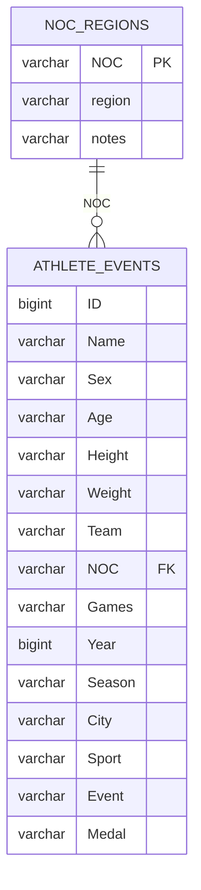

# Data Dictionary

Source: [Kaggle -- 120 Years of Olympic History](https://www.kaggle.com/datasets/heesoo37/120-years-of-olympic-history-athletes-and-results)

This folder contains two CSV files that together form the Olympics dataset.
`athlete_events.csv` is the primary fact table; `noc_regions.csv` is the lookup
table that maps 3-letter NOC codes to country/region names.

---

## Files

| File | Rows | Columns | Description |
|---|---|---|---|
| `athlete_events.csv` | 271,116 | 15 | One row per athlete per event per Olympic Games |
| `noc_regions.csv` | 230 | 3 | NOC code to region name lookup |

---

## Entity Relationship

---

## athlete_events.csv

Each row represents a single athlete competing in a single event at a specific
Olympic Games. An athlete who competed in 3 events at the same Games appears 3 times.
Medal winners appear once per medal earned.

| Column | Type | Nullable | Description |
|---|---|---|---|
| ID | Integer | No | Unique numeric identifier per athlete (not per appearance) |
| Name | String | No | Athlete's full name |
| Sex | String | No | M or F |
| Age | Integer | Yes | Age at time of competition -- 9,474 rows missing (stored as "NA") |
| Height | Integer | Yes | Height in centimeters -- 60,171 rows missing (stored as "NA") |
| Weight | Float | Yes | Weight in kilograms -- 62,875 rows missing (stored as "NA") |
| Team | String | No | Team name (often the country, but can differ for historical NOCs) |
| NOC | String | No | 3-letter National Olympic Committee code -- join key to noc_regions |
| Games | String | No | Year and season combined, e.g. "1992 Summer" |
| Year | Integer | No | Olympic year (1896 to 2016) |
| Season | String | No | Summer or Winter |
| City | String | No | Host city name |
| Sport | String | No | Sport category, e.g. "Athletics", "Swimming" |
| Event | String | No | Specific event within the sport, e.g. "Athletics Men's 100 metres" |
| Medal | String | No | Gold, Silver, Bronze, or NA (NA = did not medal; not a missing value) |

### Coverage

| Metric | Value |
|---|---|
| Year range | 1896 to 2016 |
| Unique Games | 51 |
| Unique athletes | 135,571 |
| Unique sports | 66 |
| Unique events | 765 |
| Unique NOC codes | 230 |
| Unique host cities | 42 |
| Summer rows | 222,552 |
| Winter rows | 48,564 |

### Medal breakdown

| Medal | Count |
|---|---|
| NA (no medal) | 231,333 |
| Gold | 13,372 |
| Bronze | 13,295 |
| Silver | 13,116 |

### Numeric column ranges (NA rows excluded)

| Column | Min | Max | Avg |
|---|---|---|---|
| Age | 11 | 71 | 25.1 |
| Height (cm) | 127 | 226 | 175.4 |
| Weight (kg) | 25 | 214 | 70.7 |

---

## noc_regions.csv

Lookup table mapping each NOC code to a region name. Use `NOC` to join with
`athlete_events.csv`. The `notes` column provides alternate or historical names
for 21 of the 230 entries; 209 rows have no notes.

| Column | Type | Nullable | Description |
|---|---|---|---|
| NOC | String | No | 3-letter National Olympic Committee code (primary key) |
| region | String | No | Country or region name |
| notes | String | Yes | Historical or alternate name -- 209 of 230 rows are null |

---

## Notes

- **"NA" vs NULL**: Missing values in `Age`, `Height`, and `Weight` are stored as
  the string "NA", not as SQL NULLs. Filter with `WHERE Age != 'NA'` and cast
  explicitly when doing arithmetic: `TRY_CAST(Age AS INTEGER)`.
- **Medal = "NA"**: The string "NA" in the `Medal` column means the athlete did
  not win a medal. It is not a missing value -- 85.3% of rows carry this value.
- **Team vs region**: `Team` can differ from the region in `noc_regions` for
  historical reasons (e.g. "Australasia" was a combined Australia/New Zealand team).
  Use `region` from `noc_regions` for country-level aggregations.
- **Duplicate athletes**: The same `ID` appears multiple times -- once per event
  entered. Use `COUNT(DISTINCT ID)` when counting athletes, not `COUNT(ID)`.
