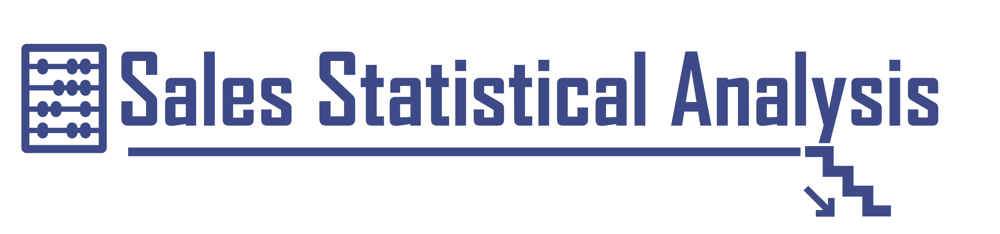

<h4 align="center">
  
</h4>

<p align="center">
  <a href="https://www.python.org/"></a>
  <a href="https://duckdb.org/"></a>
  
  <a href="https://www.linkedin.com/learning/sql-for-statistics-essential-training/"></a>
</p>

<p align="center">
  <a href="#overview">Overview</a> &bull;
  <a href="#dataset">Dataset</a> &bull;
  <a href="#libraries">Libraries</a> &bull;
  <a href="#structure">Structure</a> &bull;
  <a href="#questions">Questions</a> &bull;
  <a href="#insights">Insights</a>
</p>

---

## Overview

A SQL-based statistical analysis of one year of daily store sales data from the
LinkedIn Learning course "SQL for Statistics Essential Training" by Dan Sullivan.

The analysis covers descriptive statistics, percentile calculations, correlation
analysis, ranking, mode, and linear regression -- all written as self-contained
SQL queries executed through DuckDB. Each question is a standalone `.sql` file;
a shared Python runner loads the CSV data as a view and displays the result in a
formatted terminal table.

---

## Dataset

Source: [SQL for Statistics Essential Training](https://www.linkedin.com/learning/sql-for-statistics-essential-training/) -- LinkedIn Learning

**store_sales.csv** -- 365 rows x 6 columns (generated by `build_dataset.py` from `storedb.sql`)

| Column | Type | Description |
|---|---|---|
| sale_date | Date | Date of the transaction (2017-01-01 to 2017-12-31) |
| day_of_year | Integer | Day number within the year (1-365) |
| employee_shifts | Integer | Number of employee shifts on that day |
| units_sold | Integer | Number of units sold on that day |
| revenue | Integer | Revenue in dollars on that day |
| month_of_year | Integer | Month number (1-12) |

### Generating the Dataset

The raw data is stored as a pgSQL script (`data/storedb.sql`). Run `build_dataset.py`
once to parse the INSERT statements and produce the CSV the runner expects.

**From the project folder:**

```
uv run build_dataset.py
```

**From the repo root:**

```
uv run projects/linkedin_learning/sales_statistical_analysis/build_dataset.py
```

---

## Libraries

| Library | Purpose |
|---|---|
| [DuckDB](https://duckdb.org/) | In-process SQL engine -- reads the CSV as a view and executes `.sql` files |
| [pandas](https://pandas.pydata.org/) | Receives DuckDB query results for display and CSV generation |
| [rich](https://rich.readthedocs.io/) | Terminal table formatting via shared `show()` utility |
| [typer](https://typer.tiangolo.com/) | CLI argument handling for the runner |

> See [requirements.txt](requirements.txt) for pinned versions.

---

## Structure

```
sales_statistical_analysis/
|-- assets/
|-- data/
|-- output/
|-- scripts/
|   |-- 01_descriptive_statistics/
|   |-- 02_percentiles/
|   |-- 03_correlation/
|   |-- 04_ranking_and_mode/
|   |-- 05_linear_regression/
|   |-- runner.py
|-- build_dataset.py
|-- notes.md
|-- requirements.txt
|-- README.md
```

<details>
<summary><b>Folder & File Details</b></summary>

| Path | Description |
|---|---|
| `data/storedb.sql` | Raw pgSQL script containing CREATE TABLE + INSERT statements (the source of truth) |
| `data/store_sales.csv` | Processed CSV generated by `build_dataset.py` -- read by the runner |
| `scripts/` | SQL solution files (qxx_solution.sql) organised by topic, plus the shared DuckDB runner |
| `build_dataset.py` | Parses `storedb.sql` INSERT statements and writes `store_sales.csv` |
| `assets/` | Static images used in this README |
| `output/` | Generated chart outputs -- gitignored, tracked via .gitkeep |
| `notes.md` | Project-level learning notes and observations |
| `requirements.txt` | Python dependencies for this project |

</details>

---

## Questions

| # | Group | Question | Language | Script |
|---|---|---|---|---|
| q01 | Descriptive Statistics | What is the total number of transactions recorded over the year? | SQL | [q01_solution.sql](scripts/01_descriptive_statistics/q01_solution.sql) |
| q02 | Descriptive Statistics | How many transactions occurred in each month of the year? | SQL | [q02_solution.sql](scripts/01_descriptive_statistics/q02_solution.sql) |
| q03 | Descriptive Statistics | What are the maximum and minimum employee shifts recorded for any day during the year? | SQL | [q03_solution.sql](scripts/01_descriptive_statistics/q03_solution.sql) |
| q04 | Descriptive Statistics | What are the maximum and minimum employee shifts for each month of the year? | SQL | [q04_solution.sql](scripts/01_descriptive_statistics/q04_solution.sql) |
| q05 | Descriptive Statistics | What is the total number of units sold over the entire year? | SQL | [q05_solution.sql](scripts/01_descriptive_statistics/q05_solution.sql) |
| q06 | Descriptive Statistics | What are the total and average units sold for each month of the year? | SQL | [q06_solution.sql](scripts/01_descriptive_statistics/q06_solution.sql) |
| q07 | Descriptive Statistics | What are the population variance and standard deviation of units sold for each month? | SQL | [q07_solution.sql](scripts/01_descriptive_statistics/q07_solution.sql) |
| q08 | Percentiles | What are the discrete percentiles (25th, 50th, 75th, 95th) of daily revenue? | SQL | [q08_solution.sql](scripts/02_percentiles/q08_solution.sql) |
| q09 | Percentiles | What are the continuous percentiles (25th, 50th, 75th, 95th) of daily revenue? | SQL | [q09_solution.sql](scripts/02_percentiles/q09_solution.sql) |
| q10 | Correlation | How strongly correlated are units_sold with revenue, employee_shifts, and month_of_year? | SQL | [q10_solution.sql](scripts/03_correlation/q10_solution.sql) |
| q11 | Ranking and Mode | How do the months rank by total units sold (descending)? | SQL | [q11_solution.sql](scripts/04_ranking_and_mode/q11_solution.sql) |
| q12 | Ranking and Mode | What is the most frequently occurring employee shift count for each month? | SQL | [q12_solution.sql](scripts/04_ranking_and_mode/q12_solution.sql) |
| q13 | Linear Regression | Using linear regression on units_sold vs employee_shifts, how many employees are needed when units_sold = 1500? | SQL | [q13_solution.sql](scripts/05_linear_regression/q13_solution.sql) |

### Running a Question Script

**From the repo root using `just`:**

```
just project-sql linkedin_learning sales_statistical_analysis q01
just project-sql linkedin_learning sales_statistical_analysis q04 v2   -- versioned solution
```

**Using `uv run` directly:**

```
uv run projects/linkedin_learning/sales_statistical_analysis/scripts/runner.py q01
uv run projects/linkedin_learning/sales_statistical_analysis/scripts/runner.py q04 v2
```

---

## Insights

_To be filled in after solving._
