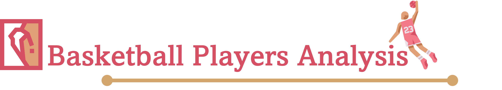

---

<h4 align="center">
  Analyzing salary and in-game metrics of top-10 highest paid NBA basketball players
  from 2005-2014 using Python
</h4>

<p align="center">
  
  
  
  
  
</p>

<p align="center">
  <a href="#overview">Overview</a> •
  <a href="#dataset">Dataset</a> •
  <a href="#libraries">Libraries</a> •
  <a href="#structure">Structure</a> •
  <a href="#questions">Questions</a> •
  <a href="#insights">Insights</a>
</p>

---

## Overview

This project focuses on analyzing salaries and various other in-game metrics of top NBA
basketball players by performing exploratory data analysis to generate insights. The
analysis covers the top-10 highest paid NBA players across seasons from 2005 to 2014.

---

## Dataset

**Source:** `data/basketball_players.yaml` | **Players:** 10 | **Seasons:** 2005-2014 | **Metrics:** 6

The raw data lives in a human-readable YAML file. Run `build_dataset.py` once to transform it into
`basketball_players_data.csv` -- a 600-row long-format table (10 players x 10 years x 6 metrics)
that all scripts and the EDA notebook read from. If you update the YAML, re-run `build_dataset.py`
and commit both files.

| Metric | Description |
|--------|-------------|
| Salary | Annual player salary in USD |
| Games Played | Number of games played in the season |
| Minutes Played | Total minutes played in the season |
| Field Goals | Number of field goals made |
| Field Goal Attempts | Number of field goal attempts |
| Points | Total points scored in the season |

**Analysis-ready DataFrame columns:**

| Column | Type | Description |
|--------|------|-------------|
| Player | string | Full name of the NBA player |
| Measure | string | Metric name (Salary, Games Played, etc.) |
| Year | int | Season year (2005-2014) |
| Values | int | Numeric value for that player-year-measure combination |

### Generating the Dataset

Run `build_dataset.py` once before using any script or the EDA notebook. Re-run it any
time `basketball_players.yaml` is updated, then commit both files.

**From the repo root (`problem-solving/`):**

```powershell
uv run .\projects\misc\basketball_players_analysis\build_dataset.py
```

**From the project folder (`basketball_players_analysis/`):**

```powershell
uv run build_dataset.py
```

---

## Libraries

| Library | Purpose |
|---------|---------|
| `numpy` | Array operations for deriving ratio metrics |
| `pandas` | Data loading, filtering, and groupby analysis |
| `matplotlib` | Trend line charts and figure layout |
| `pyyaml` | Reading the structured YAML data file |
| `pathlib` | File path resolution relative to each script (stdlib) |

> Full list: [requirements.txt](requirements.txt)

---

## Structure

```
basketball_players_analysis/
|-- assets/
|-- data/
|   |-- basketball_players.yaml
|   |-- basketball_players_data.csv
|-- output/
|-- scripts/
|-- build_dataset.py
|-- eda.ipynb
|-- notes.md
|-- requirements.txt
|-- README.md
```

<details>
<summary><b>Folder & File Details</b></summary>

<br>

| Name | Description |
|------|-------------|
| `assets/` | Static images used in this README |
| `data/basketball_players.yaml` | Human-readable raw data -- edit this to update the dataset |
| `data/basketball_players_data.csv` | Analysis-ready long-format CSV generated by `build_dataset.py` |
| `output/` | Generated chart files saved by visualization scripts (gitignored) |
| `scripts/` | Individual solution scripts, one per question, named `q##_solution_pandas.py` |
| `build_dataset.py` | Transforms the YAML into the CSV -- re-run whenever the YAML changes |
| `eda.ipynb` | Exploratory data analysis notebook -- run this first to understand the dataset before diving into the questions |
| `notes.md` | Project notes covering approach, key observations, and pandas tricks learned |
| `requirements.txt` | Python package dependencies |

</details>

---

## Questions

| # | Question | Language | Script |
|---|----------|----------|--------|
| q01 | Salary Trend -- All Players | pandas, matplotlib | [q01_solution_pandas.py](scripts/q01_solution_pandas.py) |
| q02 | Salary per Game and Salary per Field Goal Trend | pandas, matplotlib | [q02_solution_pandas.py](scripts/q02_solution_pandas.py) |
| q03 | Games Played Trend -- All Players | pandas, matplotlib | [q03_solution_pandas.py](scripts/q03_solution_pandas.py) |
| q04 | Minutes Played and Points Trend | pandas, matplotlib | [q04_solution_pandas.py](scripts/q04_solution_pandas.py) |
| q05 | Field Goals per Game and Goal Accuracy Trend | pandas, matplotlib | [q05_solution_pandas.py](scripts/q05_solution_pandas.py) |
| q06 | Field Goal Attempts per Game and Points per Game Trend | pandas, matplotlib | [q06_solution_pandas.py](scripts/q06_solution_pandas.py) |
| q07 | Minutes per Game and Field Goals per Minute Trend | pandas, matplotlib | [q07_solution_pandas.py](scripts/q07_solution_pandas.py) |
| q08 | Points per Field Goal Trend | pandas, matplotlib | [q08_solution_pandas.py](scripts/q08_solution_pandas.py) |

### Running a Question Script

**From the repo root -- via `just` (recommended):**

```powershell
just project misc basketball_players_analysis q01
just project misc basketball_players_analysis q02
# ... same pattern through q08
```

**From the repo root -- via `uv run` directly:**

```powershell
uv run .\projects\misc\basketball_players_analysis\scripts\q01_solution_pandas.py
```

**From the project folder (`basketball_players_analysis/`):**

```powershell
uv run scripts\q01_solution_pandas.py
```

---

## Insights

<!-- insights go here -->
