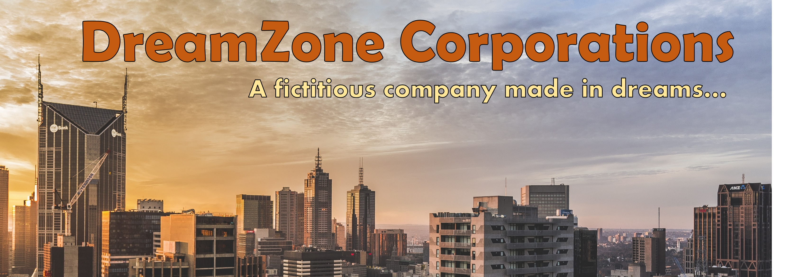

---

<h4 align="center">
  Building a basic company website for a fictitious company named DreamZone
  using plain HTML and hosting it on GitHub Pages
</h4>

<p align="center">
  
  
</p>

<p align="center">
  <a href="#overview">Overview</a> -
  <a href="#structure">Structure</a> -
  <a href="#page-sections">Page Sections</a> -
  <a href="#hosting">Hosting</a>
</p>

---

## Overview

This project focuses on building a basic website for a fictitious company named **DreamZone** using
only fundamental HTML -- no external CSS file, no JavaScript, no frameworks. Layout is handled
entirely through nested `<table>` elements, which was a common approach in early HTML development.
The site is hosted as a static page on GitHub Pages.

> This website is non-responsive and is best viewed on laptop or desktop screens.

---

## Structure

```
dreamzone_webpage/
|-- images/
|   |-- dreamzone_bg.jpg        <- hero banner image used in index.html
|   |-- project_cover_image.png <- README cover
|-- index.html                  <- single-page website
|-- README.md
```

---

## Page Sections

The webpage is structured as a sequence of full-width `<table>` rows, each serving as a
distinct section:

| Section | Description |
|---------|-------------|
| Navigation bar | Top brown bar with five links -- Home, About, Services, Clients, Contacts |
| Header | Light grey bar with the company name on the left and a phone number on the right |
| Hero banner | Full-width image spanning the page |
| Tagline and CTA | Centered tagline "Dream Plan Innovate" with a Contact Us button and a newsletter email form |
| Info columns | Three-column bordered table covering About Us, Our Vision, and Services |
| Footer | Repeated navigation links and a copyright line |

---

## Hosting

This static website is hosted on GitHub Pages and can be viewed at:

**[DreamZone Website](https://quantumudit.github.io/problem-solving/projects/misc/dreamzone_webpage/)**
